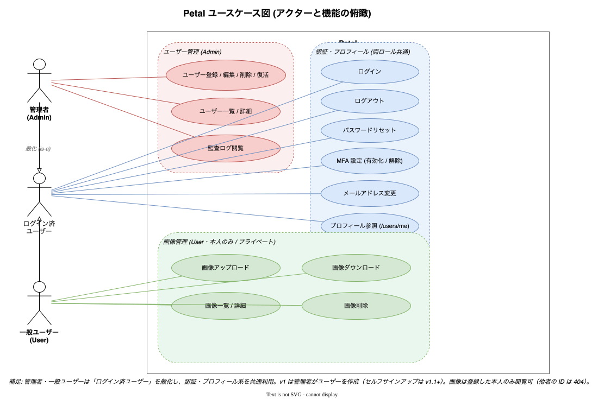

# 要求仕様

Petal の機能要件・非機能要件をまとめる。実装済みの機能は [20_features/](../20_features/) に現状仕様がある。

## ユースケース図

管理者 / 一般ユーザーと、ユーザー管理・認証・画像管理の機能俯瞰。

## 1. 機能要件

### ユーザー管理・認証

| # | 機能 | 概要 | 実装ドキュメント |
| - | ---- | ---- | ---- |
| 1 | ユーザー登録 | 管理者がユーザーを作成する（Cognito 招待 + DB 登録） | [user-management](../20_features/02_user-management.md) |
| 2 | ユーザー編集 | 管理者がユーザー情報を更新する | [user-management](../20_features/02_user-management.md) |
| 3 | ユーザー削除/復活 | 管理者がユーザーを論理削除・再有効化する | [user-management](../20_features/02_user-management.md) |
| 4 | 招待メール再送 | 管理者が未確認ユーザーへ招待を再送する | [user-management](../20_features/02_user-management.md) |
| 5 | ログイン/ログアウト | メール + パスワードで認証、GlobalSignOut でログアウト | [authentication](../20_features/01_authentication.md) |
| 6 | トークンリフレッシュ | リフレッシュトークンでアクセストークンを更新 | [authentication](../20_features/01_authentication.md) |
| 7 | ログインロックアウト | 連続失敗でアカウントを一時ロック | [authentication](../20_features/01_authentication.md) |
| 8 | MFA (TOTP) | 任意の二要素認証 | [authentication](../20_features/01_authentication.md) |
| 9 | セルフサインアップ | ユーザー自身による登録（env で有効/無効切替） | [self-service-account](../20_features/03_self-service-account.md) |
| 10 | プロフィール変更 | 自分の氏名・カナを変更 | [self-service-account](../20_features/03_self-service-account.md) |
| 11 | パスワード変更/リセット | 自分のパスワード変更、忘れた場合のリセット | [self-service-account](../20_features/03_self-service-account.md), [authentication](../20_features/01_authentication.md) |
| 12 | メールアドレス変更 | 検証コード付きのメール変更フロー | [self-service-account](../20_features/03_self-service-account.md) |
| 13 | 監査ログ | ユーザー管理操作の記録・管理者閲覧 | [audit-logs](../20_features/06_audit-logs.md) |

### コンテンツ（画像）管理

| # | 機能 | 概要 | 実装ドキュメント |
| - | ---- | ---- | ---- |
| 14 | 画像アップロード | D&D / ファイル選択 / カメラから画像を S3 に保存 | [image-management](../20_features/04_image-management.md) |
| 15 | 画像一覧 | 自分の画像をグリッド + ページングで表示 | [image-management](../20_features/04_image-management.md) |
| 16 | 画像詳細 | 個別画像のメタ情報表示 | [image-management](../20_features/04_image-management.md) |
| 17 | 画像ダウンロード | 署名付き URL でダウンロード | [image-management](../20_features/04_image-management.md) |
| 18 | 画像削除 | 論理削除 | [image-management](../20_features/04_image-management.md) |

### PWA

| # | 機能 | 概要 | 実装ドキュメント |
| - | ---- | ---- | ---- |
| 19 | PWA 化 | manifest・アイコン・Service Worker・キャッシュ戦略 | [pwa](../20_features/07_pwa.md) |
| 20 | SW 更新通知 / インストール導線 / standalone 検出 | — | [pwa](../20_features/07_pwa.md) |

## 2. 非機能要件

| 区分 | 要件 |
| ---- | ---- |
| セキュリティ | 認証は AWS Cognito。クライアントシークレットはバックエンドのみ保持（Confidential client + SECRET_HASH）。秘密情報を `NEXT_PUBLIC_*` に置かない。 |
| プライバシー | 画像は所有者本人のみ閲覧可。S3 へのアクセスは署名付き URL 経由。 |
| データ保全 | 削除は論理削除（物理削除しない）。監査ログは追記専用。Neon は週次 `pg_dump` で S3 バックアップ。 |
| コスト | 個人運用前提。DB のみ Neon Free、その他 AWS 無料枠/従量で月 $2〜6 を目標（[specs/04](../specs/04_db-neon-aws-hybrid.md)）。 |
| 可用性 | Neon Free の自動サスペンド対策に週次 keep-alive。低トラフィック前提。 |
| 品質 | Application 層のユニットテスト必須。CI で lint/test/build をゲート。 |

## 3. 将来構想

- OAuth 認証（Google / GitHub）
- コンテンツの一般公開設定
- 通知機能
- LLM API（Claude / ChatGPT / Gemini）を活用した AI 機能
- 音声など他コンテンツへの対応

## 関連ドキュメント

- 原典 → [specs/01_requirements.md](../specs/01_requirements.md)
