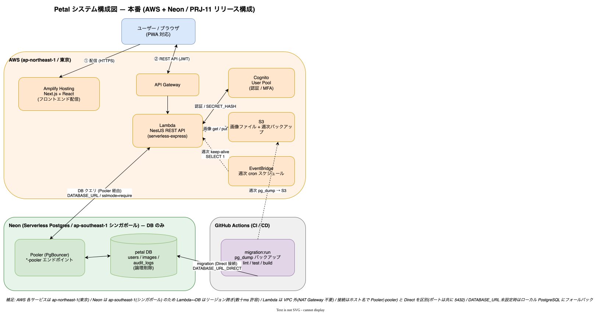
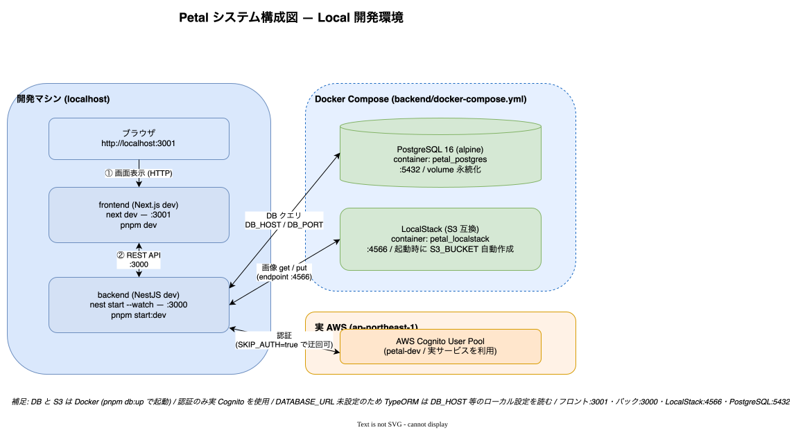

# システムアーキテクチャ

## 概要

Petal はモノリポ構成の Web アプリケーション。フロントエンド（Next.js）とバックエンド（NestJS）が REST API で通信し、認証は AWS Cognito、画像ストレージは AWS S3、データベースは Neon Postgres を使う。

## 構成図

```text
[Next.js / Amplify Hosting (ap-northeast-1)]
            │ HTTPS (REST + JWT)
            ▼
[NestJS / Lambda + API Gateway (ap-northeast-1)]
   ├──→ AWS Cognito  (ap-northeast-1)             … 認証（SECRET_HASH 付き Confidential client）
   ├──→ AWS S3       (ap-northeast-1)             … 画像ファイル（署名付き URL でやり取り）
   └──→ Neon Postgres(ap-southeast-1 / Singapore) … ユーザー・画像メタ・監査ログ
```

- フロントとバックは REST API で通信する。
- 認証は Cognito 発行の JWT。バックエンドが検証する（フロントは Cognito SDK を直接叩かない）。
- 画像本体は S3、メタデータ（ファイル名・サイズ等）は Postgres に保存する。
- **Cognito へのアクセスはすべてバックエンド経由**。クライアントシークレットはバックエンドのみが保持する。

### 本番構成図



### ローカル構成図

ローカルは DB（PostgreSQL）と S3 互換（LocalStack）を Docker で起動し、認証のみ実 Cognito を使う。



## なぜ DB だけ Neon か

個人運用では RDS の常時課金が固定費として重いため、**DB だけサーバーレス Postgres（Neon）に逃がし、それ以外は AWS のまま** という構成を採用している。Lambda は VPC に入れず、Neon へはインターネット経由で接続する（NAT Gateway 不要）。

- Neon は東京リージョン未提供のため Lambda（東京）↔ Neon（シンガポール）は跨ぎになり、クエリあたり数十 ms のレイテンシが乗る。低トラフィック前提で許容している。
- 接続は **Pooler（PgBouncer）経由**。Lambda の同時実行による接続枯渇を防ぐ。

詳細・検討経緯 → [specs/04_db-neon-aws-hybrid.md](../specs/04_db-neon-aws-hybrid.md)、構築 → [30_operations/03_database-setup.md](../30_operations/03_database-setup.md)

## モノリポ構成

```text
petal/
  backend/    # NestJS REST API（独立 pnpm プロジェクト）
  frontend/   # Next.js（独立 pnpm プロジェクト）
  docs/       # ドキュメント
  scripts/    # リポジトリ共通スクリプト
  AGENTS.md   # AI エージェント向け指示
```

- パッケージマネージャは **pnpm のみ**（npm / yarn 禁止）。
- **pnpm workspace は組まない**。`backend/` と `frontend/` はそれぞれ独立した pnpm プロジェクトで、依存は各ディレクトリで個別に install する（`cd backend && pnpm install` / `cd frontend && pnpm install`）。
- 各 `pnpm-workspace.yaml` は `packages:` を持たず、`allowBuilds` 等の設定専用ファイル。

## 実行環境

| 環境 | DB | ストレージ | 認証 | ホスティング |
| ---- | -- | ---------- | ---- | ------------ |
| Local | Docker Postgres | Localstack（S3 互換） | 実 Cognito | ローカル起動 |
| Development | Neon (dev) | S3 (dev バケット) | Cognito (dev プール) | Lambda / Amplify |
| Production | Neon | S3 | Cognito | Lambda / Amplify |

環境差分は環境変数で吸収する。Cognito はローカルでも実 AWS を使う（Localstack の Cognito は使わない）。

## 関連ドキュメント

- バックエンド設計 → [02_backend-architecture.md](02_backend-architecture.md)
- フロントエンド設計 → [03_frontend-architecture.md](03_frontend-architecture.md)
- デプロイ → [30_operations/05_deployment.md](../30_operations/05_deployment.md)
- 原典 → [specs/02_ implementations.md](../specs/02_%20implementations.md), [specs/04_db-neon-aws-hybrid.md](../specs/04_db-neon-aws-hybrid.md)
