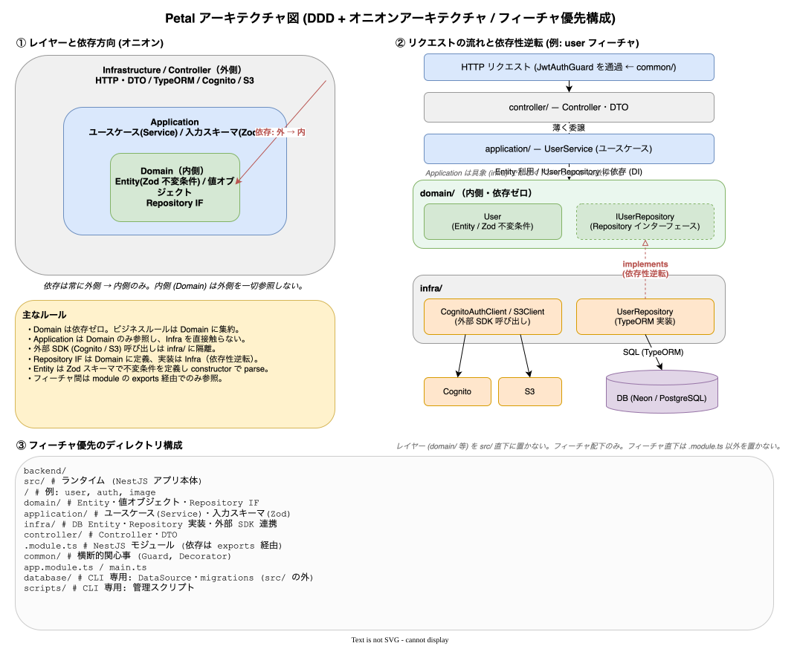

# バックエンドアーキテクチャ

NestJS + TypeORM による REST API。**DDD + オニオンアーキテクチャ** を、**フィーチャ（機能単位）優先** のディレクトリ構成で実現する。

## オニオンアーキテクチャ

依存の方向は常に **外側 → 内側**。内側のレイヤーは外側を参照しない。

```text
┌─────────────────────────────┐
│  Infrastructure（外側）      │ DB, S3, Cognito, HTTP
│  ┌───────────────────────┐  │
│  │  Application          │  │ ユースケース（サービス層）
│  │  ┌─────────────────┐  │  │
│  │  │  Domain（内側）  │  │  │ エンティティ・値オブジェクト・リポジトリ IF
│  │  └─────────────────┘  │  │
│  └───────────────────────┘  │
└─────────────────────────────┘
```

| レイヤー | 役割 | 主な中身 |
| -------- | ---- | -------- |
| Domain | ビジネスロジックの中核。外部依存なし。 | エンティティ（Zod スキーマ）、リポジトリインターフェース、enum |
| Application | ユースケース。Domain を使い Infra に依存しない。 | `*.service.ts`、入力スキーマ |
| Infrastructure | DB・外部サービスの具体実装。Domain の IF を実装。 | TypeORM エンティティ・リポジトリ実装、Cognito/S3 クライアント |
| Controller | HTTP 境界。薄く Service に委譲。 | `*.controller.ts`、DTO |

レイヤーと依存方向（外→内）・依存性逆転（Repository IF は domain、実装は infra）・フィーチャ優先構成:



- リポジトリのインターフェースは Domain に定義し、実装は Infrastructure に置く。
- 外部 SDK（Cognito, S3）の呼び出しは **必ず `infra/` に隔離**する。`application/` から SDK を直接触らない。
- フィーチャ間の依存は NestJS モジュールの `exports` を経由する。他フィーチャの内部実装ファイルを直接 import しない。

## ディレクトリ構成

```text
backend/
  src/                      # ランタイム（NestJS アプリ本体）
    <feature>/              # audit, auth, image, user
      domain/               # エンティティ・値オブジェクト・リポジトリ IF・enum
      application/          # サービス・入力スキーマ
      infra/                # TypeORM エンティティ・リポジトリ実装・外部サービス連携
      controller/           # コントローラー・DTO
      <feature>.module.ts   # NestJS モジュール定義
    common/                 # 横断的関心事（guards, decorators, exceptions, observability, types）
    app.module.ts
    main.ts                 # ローカル/通常起動のエントリ
    lambda.ts               # Lambda ハンドラ（serverless-express）
    openapi.config.ts       # Swagger 設定
    openapi-export.ts       # openapi.json 書き出し
  database/                 # CLI 専用：DataSource・マイグレーション
  scripts/                  # CLI 専用：管理スクリプト
```

`src/` には HTTP サーバとして動くコードのみを置く。`database/` `scripts/` は CLI 実行ツールで `src/` の外に置く。

### レイヤー配置のルール

- レイヤー（`domain/` 等）を `src/` 直下に置かない。必ずフィーチャ配下に置く。
- フィーチャ直下に `<feature>.module.ts` 以外のファイルを置かない。
- そのフィーチャに該当レイヤーの実体がなければサブディレクトリを作らなくてよい（例: `auth` は domain エンティティを持たない）。
- 真に複数フィーチャから参照される共通コードのみ `common/` に置く。

## フィーチャ一覧

| フィーチャ | 責務 | 主なエンドポイント |
| ---------- | ---- | ------------------ |
| `auth` | 認証（ログイン・トークン・パスワード・MFA・サインアップ） | `/auth/*` |
| `user` | ユーザー管理・自分の情報 | `/users/*` |
| `image` | 画像のアップロード・一覧・詳細・削除 | `/images/*` |
| `audit` | 監査ログ | `/audit-logs` |
| `common` | ガード・デコレーター・例外・観測性 | （横断） |

## トランザクション境界（外部副作用との整合性）

DB の永続化と Cognito / S3 の副作用を同時に変える操作では、安全側に倒すため次の順序で境界を引く。

```text
BEGIN
  事前チェック（重複・競合）
  DB の UPDATE/INSERT/DELETE（まだ可視化しない）
  外部 API 呼び出し
    成功 → COMMIT
    失敗 → ROLLBACK
END
```

- トランザクション境界はリポジトリ IF の `runInTransaction(fn)` で表現し、Application 層が TypeORM の `DataSource` / `EntityManager` を直接 import しない（オニオン依存方向の維持）。
- 参考実装: メール変更フロー（[20_features/03_self-service-account.md](../20_features/03_self-service-account.md)、原典 [specs/20](../specs/20_email-change-flow.md)）。

## 関連ドキュメント

- ドメインモデル → [04_domain-model.md](04_domain-model.md)
- DB スキーマ → [05_database-schema.md](05_database-schema.md)
- API 設計 → [06_api-design.md](06_api-design.md)
- コーディング規約 → [07_coding-rules.md](07_coding-rules.md)
- 認可（ガード）→ [20_features/05_authorization.md](../20_features/05_authorization.md)
- 原典 → [specs/00_rules.md](../specs/00_rules.md)
