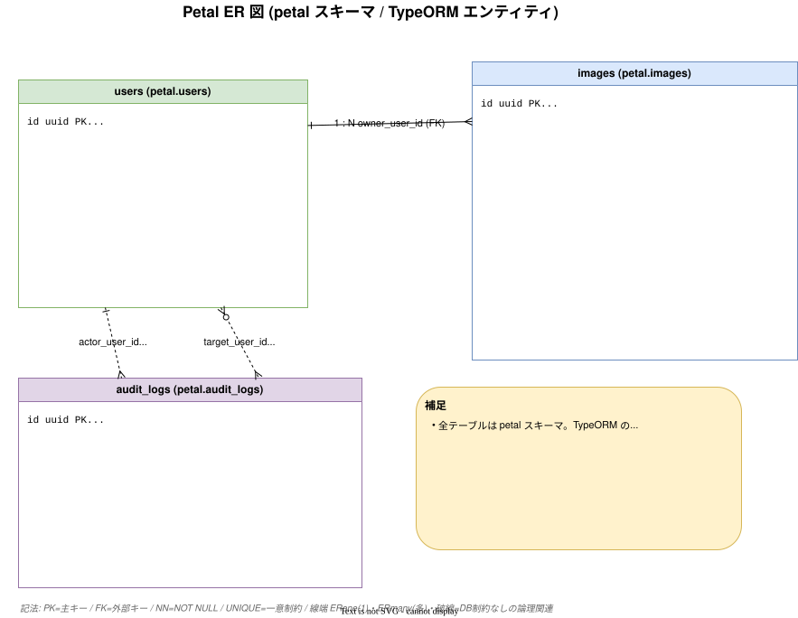

# データベーススキーマ

PostgreSQL（Neon / ローカルは Docker）。スキーマ名は `petal`。ORM は TypeORM。スキーマ変更はすべてマイグレーションで管理する。

## テーブル一覧

すべて `petal` スキーマ。エンティティ定義は `backend/src/<feature>/infra/*.entity.ts`。

### users

| カラム | 型 | 制約 |
| ------ | -- | ---- |
| id | uuid | PK |
| cognito_sub | varchar(255) | UNIQUE |
| email | varchar(255) | UNIQUE |
| name | varchar(100) | |
| name_kana | varchar(100) | |
| role | enum | default `user` |
| created_at / updated_at | timestamptz | |
| deleted_at | timestamptz | nullable（論理削除） |

定義: [backend/src/user/infra/user.entity.ts](../../backend/src/user/infra/user.entity.ts)

### images

| カラム | 型 | 制約 |
| ------ | -- | ---- |
| id | uuid | PK |
| owner_user_id | uuid | FK → users（`onDelete: RESTRICT`） |
| s3_key | varchar(512) | UNIQUE |
| original_filename | varchar(255) | |
| mime_type | varchar(100) | |
| size_bytes | bigint | |
| title | varchar(255) | nullable |
| description | varchar(1000) | nullable |
| created_at / updated_at | timestamptz | |
| deleted_at | timestamptz | nullable（論理削除） |

インデックス: `IDX_images_owner_created (owner_user_id, created_at)` — 所有者別の新着順一覧用。
定義: [backend/src/image/infra/image.entity.ts](../../backend/src/image/infra/image.entity.ts)

### audit_logs（追記専用）

| カラム | 型 | 制約 |
| ------ | -- | ---- |
| id | uuid | PK |
| actor_user_id | uuid | index |
| action | enum `audit_action` | |
| target_user_id | uuid | nullable, index |
| metadata | jsonb | nullable |
| created_at | timestamptz | index |

`deleted_at` を持たない（履歴として永続）。定義: [backend/src/audit/infra/audit-log.entity.ts](../../backend/src/audit/infra/audit-log.entity.ts)

### login_attempts

| カラム | 型 | 制約 |
| ------ | -- | ---- |
| email | varchar(255) | PK |
| fail_count | int | default 0 |
| first_failed_at | timestamptz | nullable |
| locked_until | timestamptz | nullable |
| updated_at | timestamptz | |

定義: [backend/src/auth/infra/login-attempt.entity.ts](../../backend/src/auth/infra/login-attempt.entity.ts)

## ER 図

```text
users 1 ──< images        （owner_user_id, onDelete: RESTRICT）
users 1 ──< audit_logs     （actor_user_id / target_user_id, FK 制約なしの参照）
login_attempts             （email を主キーに独立）
```



## 論理削除（ソフトデリート）

- レコード削除はすべて論理削除。物理削除しない。
- 各テーブルに `deleted_at timestamptz` を持ち、TypeORM の `@DeleteDateColumn()` を使う。
- `deleted_at` が NULL でないレコードは削除済み。TypeORM のソフトデリート機能でクエリから自動除外される。
- 例外: **追記専用テーブル（audit_logs）** は `deleted_at` を持たず、UPDATE/DELETE 系 API を提供しない。

## マイグレーション

- `synchronize: false`（自動同期しない）。スキーマ変更は必ずマイグレーションファイルで管理。
- ファイルは [backend/database/migrations/](../../backend/database/migrations/) に置く。
- DB 接続設定（CLI 用）は `backend/database/data-source.ts`。

主要コマンド（`backend/` で実行）:

```bash
pnpm migration:generate database/migrations/<名前>  # エンティティ差分から生成
pnpm migration:create   database/migrations/<名前>  # 空ファイル作成（手書き用）
pnpm migration:run                                  # 実行
pnpm migration:revert                               # 直前を取り消し
pnpm migration:show                                 # 適用状況
```

既存マイグレーション: スキーマ作成 → users → images → users への email 追加 → audit_logs → login_attempts。

## Neon 固有の接続設定

Neon は Pooler（PgBouncer transaction mode）経由で接続するため、TypeORM 側で SSL 有効化・prepared statement 無効化・プール数の制限が必要。詳細は [30_operations/03_database-setup.md](../30_operations/03_database-setup.md)、原典 [specs/34_typeorm-neon.md](../specs/34_typeorm-neon.md)。

## 関連ドキュメント

- ドメインモデル → [04_domain-model.md](04_domain-model.md)
- DB 構築 → [30_operations/03_database-setup.md](../30_operations/03_database-setup.md)
- 原典 → [specs/00_rules.md](../specs/00_rules.md) §4
