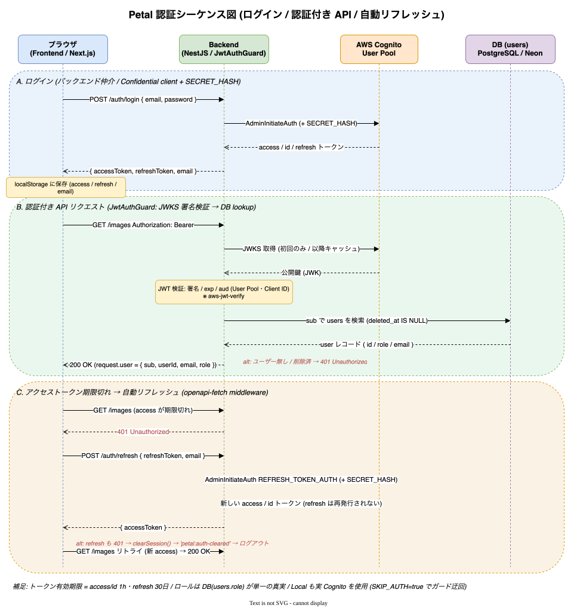
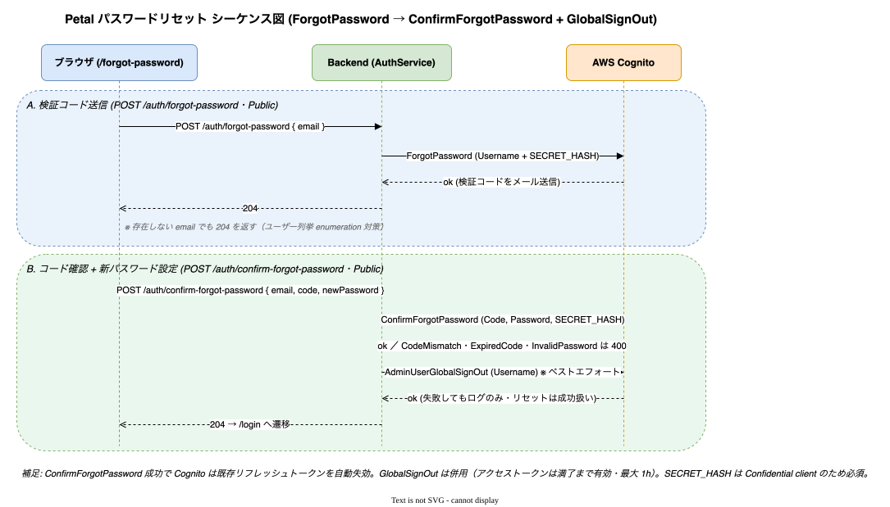
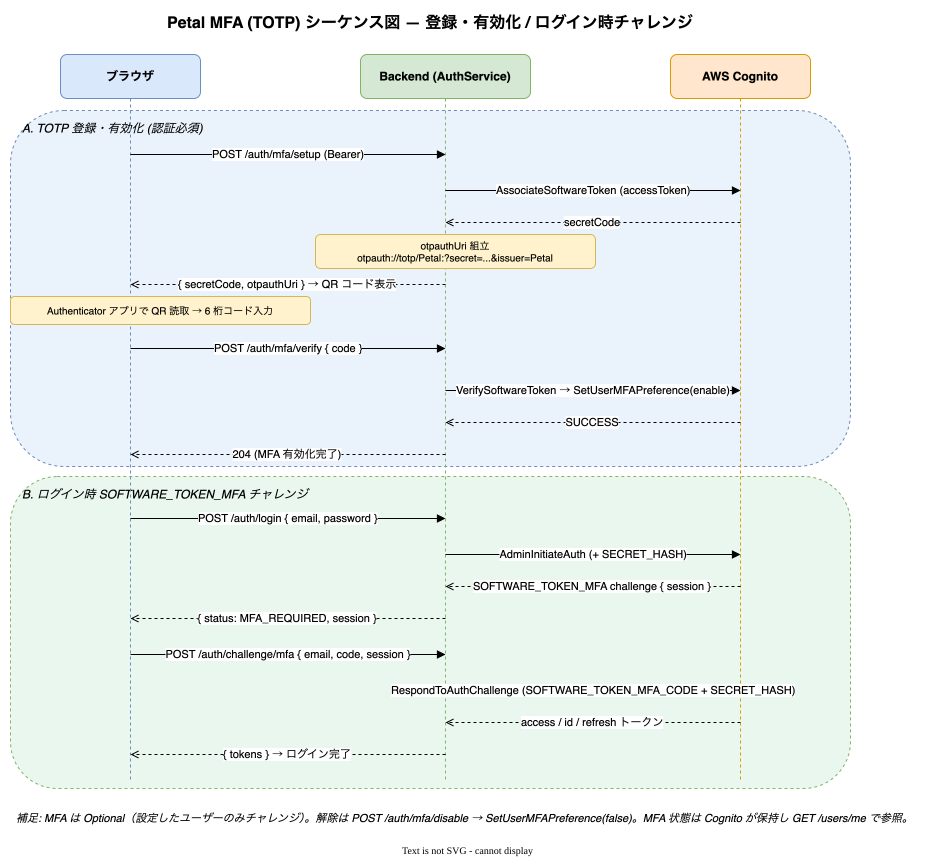

# 認証

ログイン・ログアウト・トークン更新・ログインロックアウト・MFA(TOTP)・パスワードリセット。
認証基盤は **AWS Cognito**。フロントは Cognito SDK を直接叩かず、すべてバックエンド経由で操作する（SECRET_HASH 付きの Confidential client）。

実装: [backend/src/auth/](../../backend/src/auth/) / フロント [frontend/src/lib/api-hooks/use-auth-api.ts](../../frontend/src/lib/api-hooks/use-auth-api.ts), [frontend/src/contexts/AuthContext.tsx](../../frontend/src/contexts/AuthContext.tsx)

## 認証シーケンス

ログイン（バックエンド仲介 + SECRET_HASH）／認証付き API（JwtAuthGuard の JWKS 検証 → DB lookup）／401 時の自動リフレッシュ（openapi-fetch middleware）。

## ログイン / ログアウト

- `POST /auth/login`（Public）: email + password を受け、バックエンドが SECRET_HASH 付きで Cognito 認証。成功でトークン、追加対応が必要なときは**チャレンジ**を返す。
- チャレンジ:
  - `POST /auth/challenge/new-password`: 初回ログイン時の新パスワード設定。
  - `POST /auth/challenge/mfa`: MFA(TOTP) コードの応答。
- `POST /auth/logout`（要認証）: Cognito **GlobalSignOut** で全リフレッシュトークンを失効。
- フロントはアクセストークンを `localStorage` に保持し、以降の API に `Authorization: Bearer <token>` を付与する。

## トークンリフレッシュ

- `POST /auth/refresh`（Public）: リフレッシュトークンでアクセストークンを更新。
- フロントは `lib/openapi/client.ts` の middleware で 401 を検知し**自動リフレッシュ**してリトライする。
- 原典: [specs/27_refresh-token-flow.md](../specs/27_refresh-token-flow.md)

## ログインロックアウト

- 連続ログイン失敗を `petal.login_attempts`（email 単位）でカウントし、**5 回 / 15 分** でロック。ロック中の `/auth/login` は **429** を返す。
- Lambda 前提のため in-memory ではなく **DB ストア**で実装。
- 実装: [backend/src/auth/infra/login-attempt.entity.ts](../../backend/src/auth/infra/login-attempt.entity.ts)、原典 [specs/57_login-lockout.md](../specs/57_login-lockout.md)

## パスワードリセット

`POST /auth/forgot-password` → `POST /auth/confirm-forgot-password`（いずれも Public）。Cognito ForgotPassword + ConfirmForgotPassword、確定後に GlobalSignOut。enumeration 対策で要求は常に成功応答にする。

原典: [specs/19_password-reset.md](../specs/19_password-reset.md)

## MFA (TOTP)

Cognito Software Token MFA（Optional）。マイページ（[frontend/src/app/(admin)/me/mfa/](../../frontend/src/app/(admin)/me/mfa/)）から設定する。

- `POST /auth/mfa/setup`: TOTP シークレットを発行（QR 表示用）。
- `POST /auth/mfa/verify`: 認証アプリのコードで有効化（SetUserMFAPreference）。
- `POST /auth/mfa/disable`: 無効化。
- ログイン時は `SOFTWARE_TOKEN_MFA` チャレンジが発生し `POST /auth/challenge/mfa` で応答。

原典: [specs/29_mfa-totp.md](../specs/29_mfa-totp.md)

## パスワード変更（ログイン中）

`POST /auth/change-password`（要認証）。Cognito ChangePassword。セッション失効なし。詳細は [03_self-service-account.md](03_self-service-account.md)。

## 関連ドキュメント

- 認可（JwtAuthGuard / RolesGuard）→ [05_authorization.md](05_authorization.md)
- セルフサインアップ・自分の情報変更 → [03_self-service-account.md](03_self-service-account.md)
- Cognito 構築 → [30_operations/02_cognito-setup.md](../30_operations/02_cognito-setup.md)
- 原典 → [specs/11_user-info_and_authentication.md](../specs/11_user-info_and_authentication.md), [specs/18_logout-api.md](../specs/18_logout-api.md)
