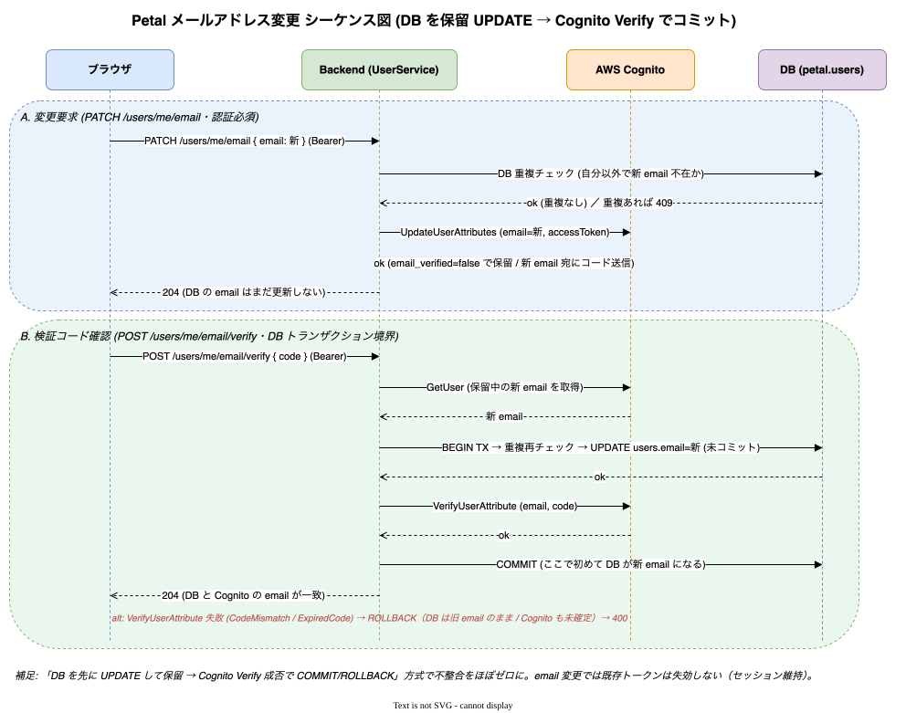

# セルフサービス（自分のアカウント）

ユーザー自身が行う操作: セルフサインアップ・プロフィール変更・パスワード変更・メールアドレス変更。
マイページ [frontend/src/app/(admin)/me/](../../frontend/src/app/%28admin%29/me/) に導線を集約。実装: [backend/src/auth/](../../backend/src/auth/), [backend/src/user/](../../backend/src/user/)

## セルフサインアップ

- `POST /auth/signup` → `POST /auth/confirm-signup`（Public）。Cognito SignUp / ConfirmSignUp、confirm 後に `role=user` で DB INSERT。
- `/signup` は 2 ステップ画面（[frontend/src/app/signup/](../../frontend/src/app/signup/)）。
- **可否は env で切替**: backend 単一 env `SELF_SIGNUP_ENABLED`（`true` のみ有効・デフォルト OFF）が真実のソース。OFF 時は `signup` / `confirm-signup` が **403**。
- 公開 `GET /auth/signup-config` でフロントに可否を伝え、`/login` の導線・`/signup` を出し分け。
- 原典: [specs/56_self-service-signup.md](../specs/56_self-service-signup.md), [specs/66_self-signup-toggle.md](../specs/66_self-signup-toggle.md)

## プロフィール変更

- `PATCH /users/me`（要認証）: 自身の `name` / `nameKana` のみ更新。`role` / `email` は Zod で無視。監査ログなし。
- マイページ `/me`（[frontend/src/app/(admin)/me/](../../frontend/src/app/%28admin%29/me/)）。
- 原典: [specs/59_my-profile.md](../specs/59_my-profile.md)

## パスワード変更

- `POST /auth/change-password`（要認証）: Cognito ChangePassword。認証必須・セッション失効なし。
- `/me/password` サブページ。`PasswordPolicyChecklist` を再利用（フロントでポリシー事前検証）。
- パスワードポリシーのフロント事前検証は共通モジュール + チェックリスト UI（原典 [specs/22_password-policy-frontend-validation.md](../specs/22_password-policy-frontend-validation.md)）。
- 原典: [specs/60_change-password.md](../specs/60_change-password.md)

## メールアドレス変更

検証コード付きの 2 ステップ。`PATCH /users/me/email`（変更要求 → 検証コード送信）→ `POST /users/me/email/verify`（確定）。

DB を保留 UPDATE → Cognito Verify の成否で COMMIT / ROLLBACK する（外部副作用との整合性を守るトランザクション境界の参考実装）。

実装: [frontend/src/lib/api-hooks/use-me-email-api.ts](../../frontend/src/lib/api-hooks/use-me-email-api.ts)、原典 [specs/20_email-change-flow.md](../specs/20_email-change-flow.md)

## パスワードリセット（パスワードを忘れた場合）

ログイン前のリセットは認証機能側にある → [01_authentication.md](01_authentication.md#パスワードリセット)。

## 関連ドキュメント

- 認証 → [01_authentication.md](01_authentication.md)
- ユーザー管理（admin 側）→ [02_user-management.md](02_user-management.md)
- トランザクション境界 → [10_architecture/02_backend-architecture.md](../10_architecture/02_backend-architecture.md)
