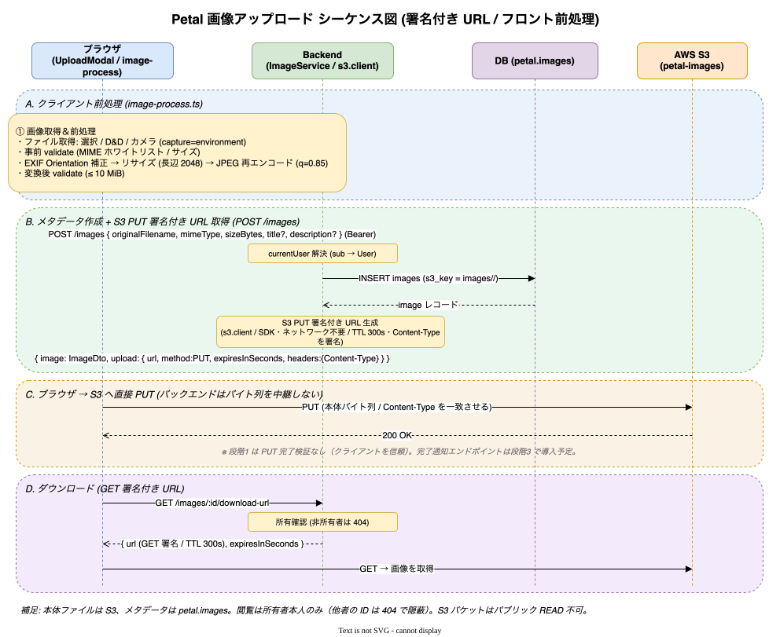

# 画像管理

画像のアップロード・一覧・詳細・ダウンロード・削除。ファイル本体は S3、メタデータは `petal.images`。画像は **所有者本人のみ閲覧可**。
実装: [backend/src/image/](../../backend/src/image/) / フロント [frontend/src/app/(authenticated)/images/](../../frontend/src/app/%28authenticated%29/images/), [frontend/src/lib/api-hooks/use-images-api.ts](../../frontend/src/lib/api-hooks/use-images-api.ts)

## エンドポイント

| メソッド | パス | 概要 |
| -------- | ---- | ---- |
| POST | /images | アップロード（メタ作成 + 署名付き URL 発行） |
| GET | /images | 自分の画像一覧 |
| GET | /images/:id | 詳細 |
| GET | /images/:id/download-url | 署名付きダウンロード URL |
| DELETE | /images/:id | 削除（論理） |

## アップロードシーケンス

フロントで前処理（EXIF Orientation 補正・リサイズ・圧縮）→ `POST /images` でメタ作成 + 署名付き URL を取得 → **ブラウザが S3 へ直接 PUT**（バックエンドはバイトを中継しない）。

原典: [specs/12_image-management.md](../specs/12_image-management.md)

## アップロード UI

- **ドラッグ＆ドロップ**: `UploadModal` にドロップゾーン。一覧ページ全体でも D&D 可。
- **ファイル選択ボタン**: ドロップゾーン内に design-system Button を内包。
- **カメラ**: `input[capture]` で端末カメラを起動。
- 前処理（EXIF 補正・リサイズ・圧縮）は共通化。アップロード後は一覧 1 ページ目へ遷移。
- 原典: [specs/44_image-upload-drag-drop.md](../specs/44_image-upload-drag-drop.md), [specs/45_image-upload-file-select-button.md](../specs/45_image-upload-file-select-button.md), [specs/49_camera-upload.md](../specs/49_camera-upload.md)

## 一覧 / 詳細

- 一覧: 3 列サムネイルグリッド + Pagination。所有者別の新着順（`IDX_images_owner_created`）。
- 詳細（[frontend/src/app/(authenticated)/images/[id]/](../../frontend/src/app/%28authenticated%29/images/[id]/)）: Card + FormField でメタ情報を 2 カラム表示。削除確認は design-system Dialog。`formatImageSize` 共通化。
- ログイン後のデフォルトページは `/images`。
- 原典: [specs/46_default-page-images.md](../specs/46_default-page-images.md), [specs/47_image-list-grid.md](../specs/47_image-list-grid.md), [specs/48_image-detail-page.md](../specs/48_image-detail-page.md)

## ストレージ

- S3。アップロード・ダウンロードとも**署名付き URL** でブラウザと S3 が直接やり取りし、バックエンドはバイトを中継しない。
- S3 オブジェクトキー（`s3_key`）は DB で一意。
- バケット/IAM/CORS の構築は [30_operations/04_storage-setup.md](../30_operations/04_storage-setup.md)。

## チャットでの画像添付

所有ライブラリの画像は LLM チャットのメッセージに添付できる（PRJ-17・[09_chat.md](09_chat.md)）。

- 入力欄から自分の画像を **最大 5 枚** 選び、本文テキストと共に送信する（添付できるのは所有者本人の画像のみ）。
- 送信時はバックエンドが S3 から画像を取得して **base64 化** し、vision 対応 provider（Claude / Gemini / OpenAI）へ渡す。
  vision 非対応 provider（既定の LocalLLM 等）には送信前にエラーで block する。
- 添付はメッセージに紐付いて永続化（`petal.chat_message_images`）され、履歴では署名付き表示 URL として返る。
- このチャット添付は、通常のアップロード／ダウンロード（署名付き URL でブラウザと S3 が直接やり取り）とは異なり、
  **バックエンドが画像バイトを取得する**経路を使う。詳細は [09_chat.md](09_chat.md) を参照。

## 削除

論理削除（`deleted_at`）。S3 オブジェクトの扱いは設計ドキュメント参照。所有者ユーザーは画像が残る限り物理削除できない（`onDelete: RESTRICT`）。チャット添付に使われている画像も `onDelete: RESTRICT`（`chat_message_images`）により残存する限り物理削除されない。

## 関連ドキュメント

- DB スキーマ → [10_architecture/05_database-schema.md](../10_architecture/05_database-schema.md)
- S3 構築 → [30_operations/04_storage-setup.md](../30_operations/04_storage-setup.md)
- 原典 → [specs/12_image-management.md](../specs/12_image-management.md)
