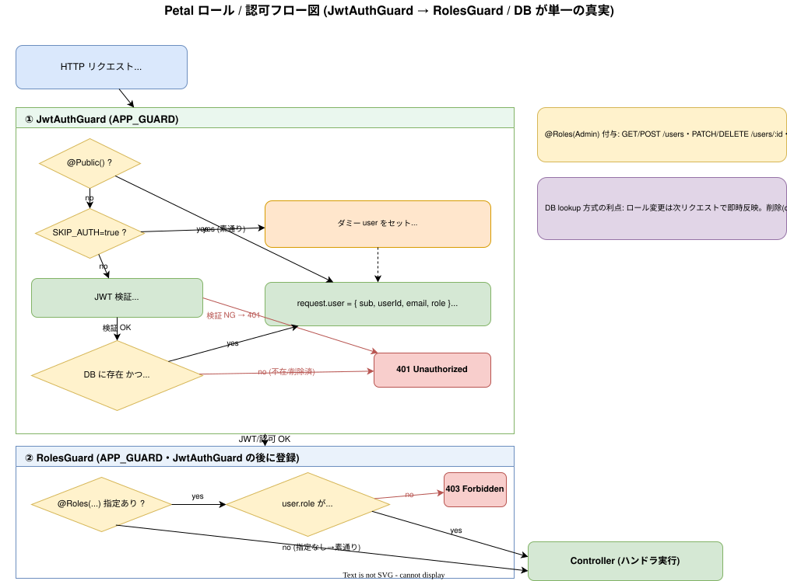

# 認可（Authorization）

認証済みユーザーのロールに基づくアクセス制御。**DB を単一の真実**とし、バックエンドのガードで認可する。フロントはナビ表示とルートガードで補助する。
実装: [backend/src/common/guards/](../../backend/src/common/guards/), [backend/src/common/decorators/](../../backend/src/common/decorators/)

## 認可フロー

`JwtAuthGuard`（JWT を JWKS で検証 → `cognito_sub` で DB lookup → `request.user` を確立、削除済みユーザーは 401）→ `RolesGuard`（`@Roles` と照合し不足なら 403）。

## バックエンドのガード

| 要素 | 役割 |
| ---- | ---- |
| `JwtAuthGuard`（[jwt-auth.guard.ts](../../backend/src/common/guards/jwt-auth.guard.ts)） | アクセストークンを JWKS で検証し、`cognito_sub` で DB ユーザーを引いて `request.user`（id/role 等）を確立。**DB に存在しない/削除済みなら 401**。 |
| `RolesGuard`（[roles.guard.ts](../../backend/src/common/guards/roles.guard.ts)） | `@Roles(...)` のメタデータと `request.user.role` を照合。不足なら 403。 |
| `@Public()`（[public.decorator.ts](../../backend/src/common/decorators/public.decorator.ts)） | 認証不要エンドポイントの指定（login, signup, refresh 等）。 |
| `@Roles(...)`（[roles.decorator.ts](../../backend/src/common/decorators/roles.decorator.ts)） | 必要ロールの指定（admin 限定など）。 |

- ロールの真実は **DB の `users.role`**。AuthGuard が毎リクエストで DB lookup するため、Cognito グループに依存せず一貫する。
- AuthGuard の DB ユーザー存在・有効性チェックはテストで明文化（[40_processes/02_testing-strategy.md](../40_processes/02_testing-strategy.md)、原典 [specs/25](../specs/25_authguard-db-validation-tests.md)）。
- 原典: [specs/21_role-cognito-group-sync.md](../specs/21_role-cognito-group-sync.md)

## admin 限定エンドポイント

- ユーザー管理 `/users`（me 系を除く）と監査ログ `/audit-logs` は `@Roles(UserRole.Admin)`。
- 一覧は [10_architecture/06_api-design.md](../10_architecture/06_api-design.md) を参照。

## フロントエンドのガード

- `AuthContext` が role（`GET /users/me`）を保持。
- TopBar の「ユーザー」「監査ログ」リンクは **admin 時のみ表示**。
- ネスト route group `(admin)/(admin-only)/` の layout で `role !== 'admin'` を 403 表示にする。
- backend が既存の `@Roles(Admin)` で守るため、フロントは UX 上の補助（バックエンドが最終防衛線）。
- 原典: [specs/67_admin-only-nav-guard.md](../specs/67_admin-only-nav-guard.md)

## 関連ドキュメント

- 認証 → [01_authentication.md](01_authentication.md)
- ユーザー管理 → [02_user-management.md](02_user-management.md)
- Cognito ⇔ DB 同期 → [08_cognito-sync.md](08_cognito-sync.md)
