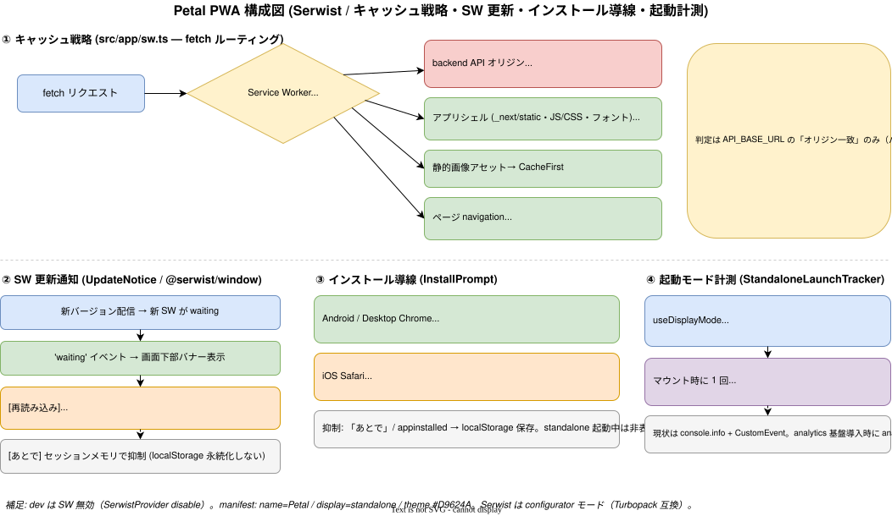

# PWA

Progressive Web App 対応。Service Worker・manifest・アイコン・キャッシュ戦略・更新通知・インストール導線・起動モード計測。
実装: [frontend/serwist.config.ts](../../frontend/serwist.config.ts), [frontend/public/](../../frontend/public/)

## 構成

Serwist（`@serwist/next`）による Service Worker。API は NetworkOnly、静的資産はキャッシュ。

## 機能

| 機能 | 内容 | 原典 |
| ---- | ---- | ---- |
| PWA 基盤 + キャッシュ戦略 | `@serwist/next` 導入・manifest・アイコン・iOS メタタグ。**backend API は NetworkOnly** | [specs/50](../specs/50_pwa-foundation.md) |
| SW 更新通知 | `waiting` イベント検知 → 画面下部バナー → `controlling` 待ち reload | [specs/51](../specs/51_sw-update-notice.md) |
| インストール導線 | Android/Desktop の `beforeinstallprompt` バナー + iOS Safari の手順案内モーダル。localStorage で却下/インストール済みを抑制 | [specs/52](../specs/52_install-prompt.md) |
| スタンドアロン検出・計測 | `display-mode: standalone` 判定フック + `trackEvent('app_launch')` | [specs/53](../specs/53_standalone-detection.md) |

## キャッシュ戦略

- **backend API は NetworkOnly**（常に最新を取得。古いデータを返さない）。
- 静的資産・アプリシェルはキャッシュしオフライン起動を可能にする。
- オフライン時のフォールバックは [frontend/src/app/~offline/](../../frontend/src/app/~offline/)。

## 品質ゲート

Lighthouse PWA 監査を CI に組み込み、`installable-manifest` をゲートにする（`@lhci/cli` + GitHub Actions、[frontend/lighthouserc.json](../../frontend/lighthouserc.json)）。詳細は [30_operations/07_observability.md](../30_operations/07_observability.md)、原典 [specs/54](../specs/54_lighthouse-pwa-ci.md)。

## 関連ドキュメント

- フロントエンド設計 → [10_architecture/03_frontend-architecture.md](../10_architecture/03_frontend-architecture.md)
- 観測性（Lighthouse CI）→ [30_operations/07_observability.md](../30_operations/07_observability.md)
- 原典 → [specs/50_pwa-foundation.md](../specs/50_pwa-foundation.md) 〜 [specs/54_lighthouse-pwa-ci.md](../specs/54_lighthouse-pwa-ci.md)
