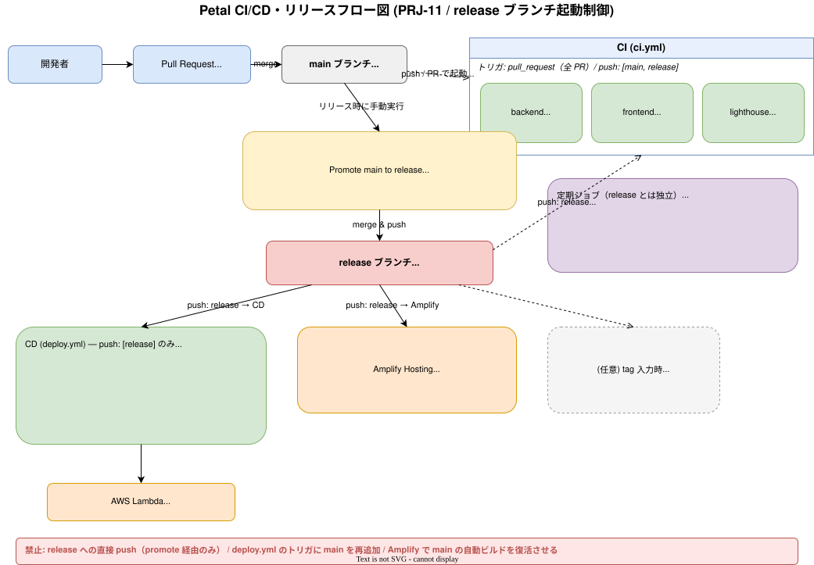

# CI/CD

GitHub Actions による CI / CD と release ブランチ運用。ワークフロー定義は [.github/workflows/](../../.github/workflows/)。

## リリースフロー

開発は `main`。`main` への push では **CI のみ**。デプロイは **`release` への push** が起点。`release` の更新は手動の `Promote main to release`（`workflow_dispatch`）で `main` をマージして行う。`release` への直接 push は禁止。

## ワークフロー一覧

| ファイル | 名前 | トリガー | 内容 |
| -------- | ---- | -------- | ---- |
| [ci.yml](../../.github/workflows/ci.yml) | CI | PR / push(`main`,`release`) | backend: lint/test/build、frontend: lint/build |
| [deploy.yml](../../.github/workflows/deploy.yml) | CD | push(`release`) / 手動 | Lambda デプロイ（build → bundle → deploy） |
| [promote-to-release.yml](../../.github/workflows/promote-to-release.yml) | Promote main to release | 手動 | `main` を `release` にマージ → push → CD 起動 → タグ/Release 作成 |
| [backup.yml](../../.github/workflows/backup.yml) | Backup (pg_dump → S3) | 週次 cron（日 01:00 UTC）/ 手動 | Neon を `pg_dump` → S3 |
| [keepalive.yml](../../.github/workflows/keepalive.yml) | Keep-alive (SELECT 1) | 週次 cron（水 00:00 UTC）/ 手動 | Neon に `SELECT 1` |

## CI（ci.yml）

- backend: `pnpm install` → lint → unit test → build。
- frontend: `pnpm install` → lint → build。
- backend / frontend は独立 pnpm プロジェクトなのでジョブ/ステップを分けて install する。
- 原典: [specs/40_github-actions-ci.md](../specs/40_github-actions-ci.md)

## CD（deploy.yml）

- `release` への push で起動。DB マイグレーション → Lambda コード更新の順。
- Amplify Hosting は Amplify 側が `release` を監視してフロントをデプロイ。
- 原典: [specs/41_github-actions-cd.md](../specs/41_github-actions-cd.md)

## Lighthouse PWA 監査

CI で `@lhci/cli` により PWA の `installable-manifest` をゲートにする（[frontend/lighthouserc.json](../../frontend/lighthouserc.json)）。詳細は [07_observability.md](07_observability.md)。

## 関連ドキュメント

- デプロイ詳細 → [05_deployment.md](05_deployment.md)
- Git/リリース運用 → [40_processes/03_git-and-release.md](../40_processes/03_git-and-release.md)
- 運用ジョブ（backup/keepalive）→ [08_operational-jobs.md](08_operational-jobs.md)
- 原典 → [specs/55_release-branch-cicd.md](../specs/55_release-branch-cicd.md), [specs/40_github-actions-ci.md](../specs/40_github-actions-ci.md), [specs/41_github-actions-cd.md](../specs/41_github-actions-cd.md)
